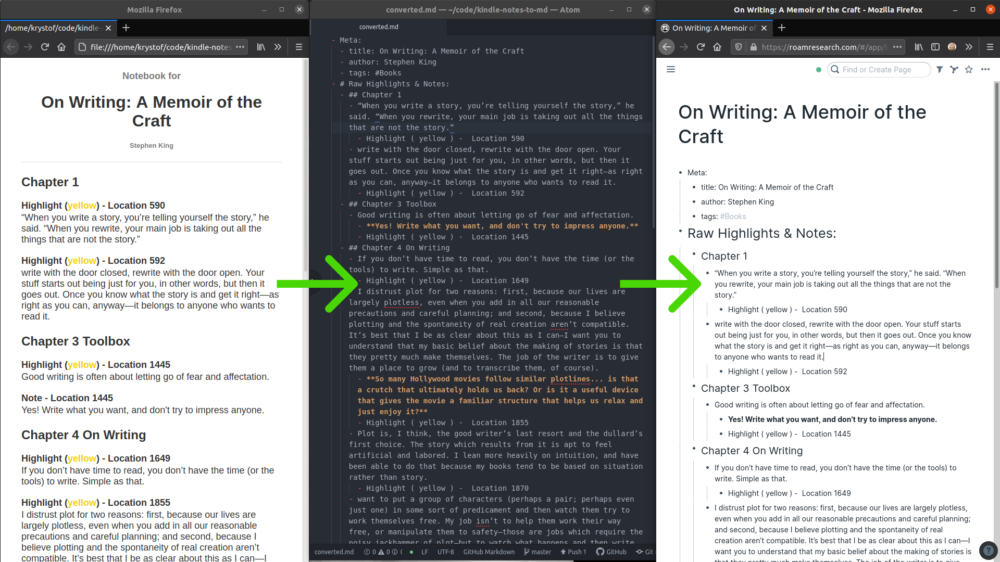

# Kindle Notes HTML to MD

Originally forked from https://github.com/krystofl/kindle-notes-to-md.

Convert an HTML file of book notes exported from an Amazon Kindle to a Markdown document.

The output format is particularly suitable for copy-pasting into
[Roam Research](https://roamresearch.com):



<!-- TOC -->
* [Kindle Notes HTML to MD](#kindle-notes-html-to-md)
* [Quickstart](#quickstart)
* [Optional functions](#optional-functions)
  * [Copying the output directly to the clipboard](#copying-the-output-directly-to-the-clipboard)
* [How to get your notes in HTML format](#how-to-get-your-notes-in-html-format)
<!-- TOC -->

# Quickstart

Install python packages in the terminal with the following commands:

    pip install pyperclip
    pip install beautifulsoup4

Convert the example notes with the relative path `.test\example_notebook.html` (or an absolute path) to a Markdown file with override function:

    python kindle_notes_html_to_md.py -y ".test\example_notebook.html" 

You can then open `example_notebook.md` in your favorite text editor.

You can import that markdown file into [Roam Research](https://roamresearch.com),
and you'll get a nicely organized note as shown in the screenshot above.
Copy-pasting into Roam no longer works.

Roam seems to be in decline; you may wish to explore alternatives,
such as [Obsidian](https://obsidian.md/).

# Optional functions

    -nl, --no-location    Do not include the source location of each note/highlight
    -c, --clipboard       Export .md directly to the clipboard instead of file
    -y, --override        Override .md file if one already exists
    -o OUTPUT, --output   A file to which save the Markdown document

## Copying the output directly to the clipboard

You can copy the output directly to your clipboard (so that you can later paste it into your preferred document) using the `-c --clipboard` flag. To
make this work, you may need to install a package with a command-line interface to X selections. On Ubuntu, you can accomplish this with

```
sudo apt-get install xclip
```

There are some known issues with this working on Windows Subsystem for Linux (WSL) under Windows 11 which are yet-to-be-investigated.

# How to get your notes in HTML format

I generally read and take notes on my Kindle e-ink reader. When I finish a book, I open the same book on the Kindle app on my phone, go to "My
Notebook" for the book (the icon looks like a page with lines), then Export Notebook. This saves the HTML file you can convert.
